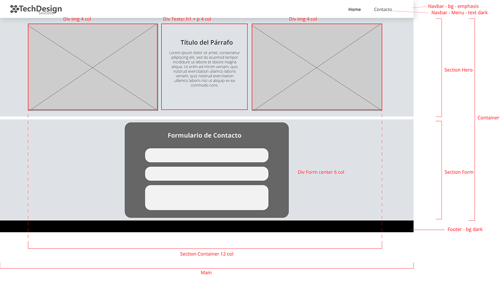
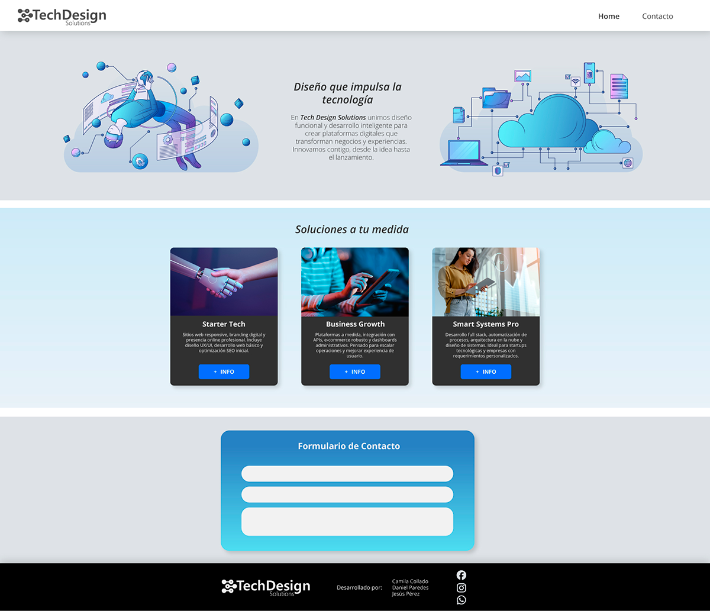

# Tech Design Solutions 💻✨

Landing page profesional para **Tech Design Solutions**, una empresa enfocada en brindar soluciones innovadoras de tecnología y diseño digital para negocios modernos.

# Wireframe



# Diseño en alta fidelidad



## 🔗 Vista en línea

[👉 Ver el sitio web](https://undostresdoce.github.io/techdesign/)

---

## 📌 Descripción

Este proyecto corresponde a una **landing page responsiva** que presenta los servicios de Tech Design Solutions, una consultora tecnológica orientada a resolver desafíos digitales mediante diseño UX/UI, desarrollo web y soluciones a medida.

Diseñada con enfoque minimalista y profesional, está pensada para captar la atención de potenciales clientes con una propuesta clara, visualmente atractiva y funcional.

---

## 🚀 Características principales

- Diseño responsivo para desktop y mobile.
- Hero section con mensaje de alto impacto.
- Cards de servicios tecnológicos (packs de soluciones).
- Estilo moderno con enfoque visual limpio y tipografía legible.
- Navegación fluida y jerarquía visual clara.
- Código limpio, estructurado y fácil de mantener.

---

## 🧱 Tecnologías utilizadas

- HTML5
- CSS3 (con diseño mobile-first)
- Google Fonts

---

## 📂 Estructura del proyecto

techdesign/
├── index.html
├── css/
│ └── styles.css
├── assets/
│ ├── images/
│ └── icons/
└── README.md


---

## 📦 Cómo clonar y ejecutar localmente

```bash
git clone https://github.com/undostresdoce/techdesign.git
cd techdesign
# Abre index.html en tu navegador

🌐 Despliegue
El sitio está desplegado en GitHub Pages.
Para actualizarlo, solo debes subir los cambios al branch main.

📌 Estado del proyecto
✅ Finalizado y funcional
🛠️ Abierto a mejoras visuales o integraciones futuras (formulario, animaciones, etc.)

✍️ Autores
Desarrollado por Camila Collado - Daniel Paredes - Jesús Pérez

📄 Licencia
Este proyecto está bajo la Licencia MIT.
Puedes usarlo, adaptarlo o mejorar libremente.
